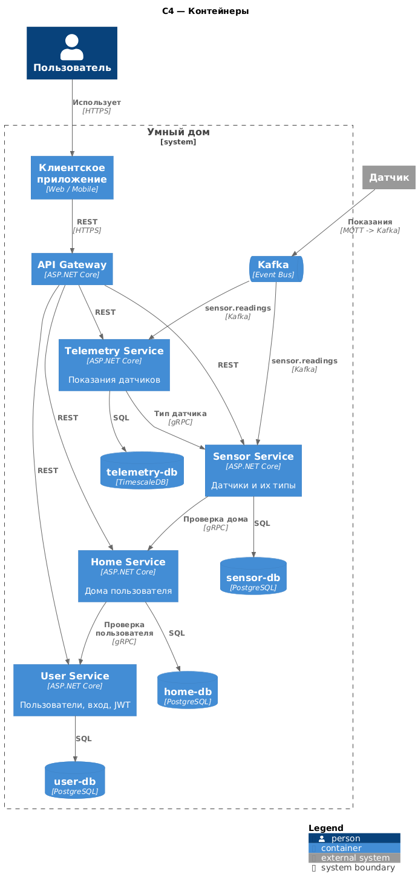
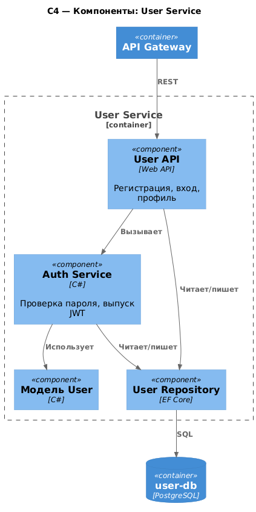
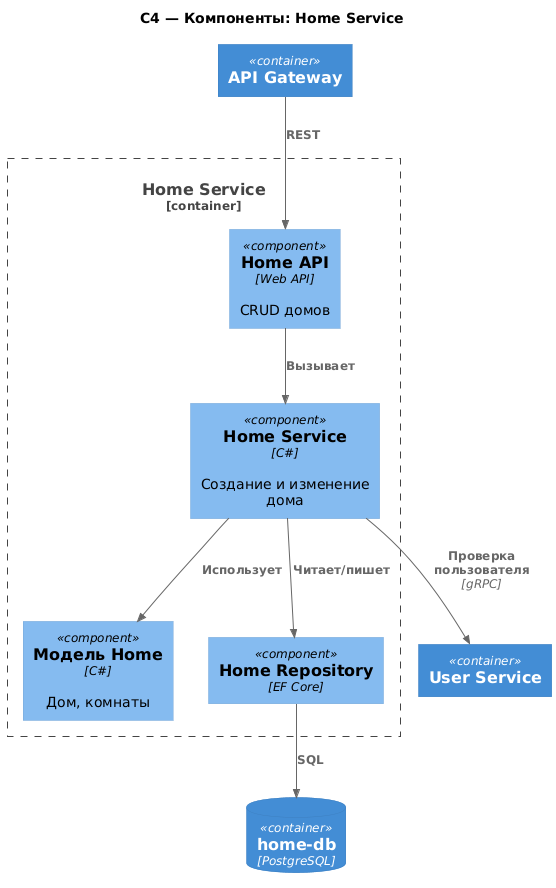
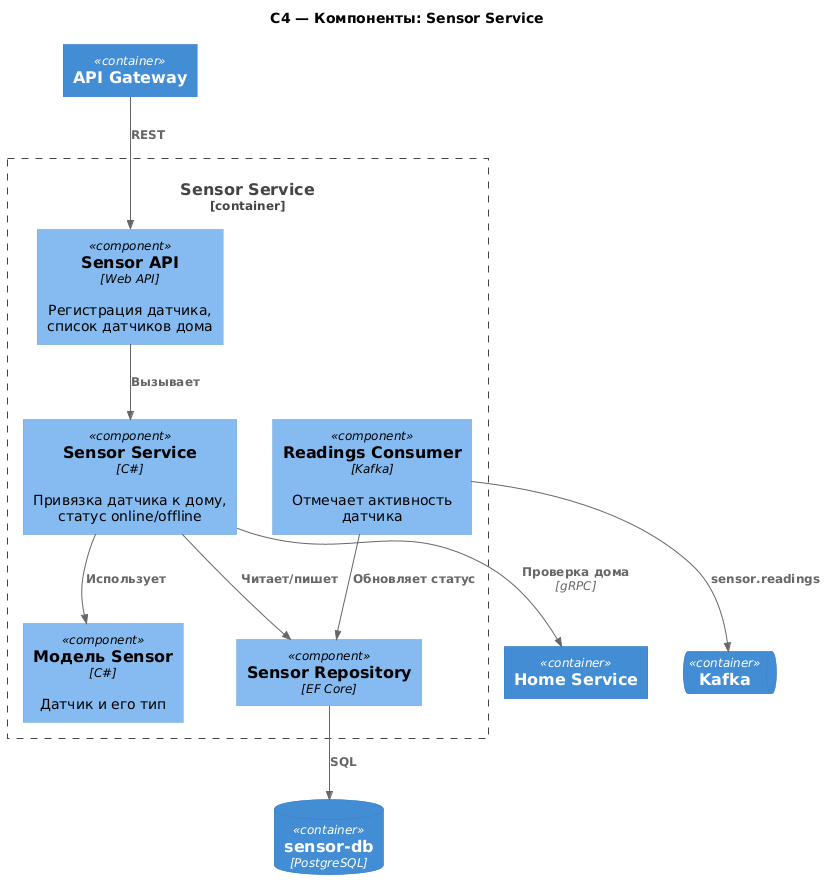
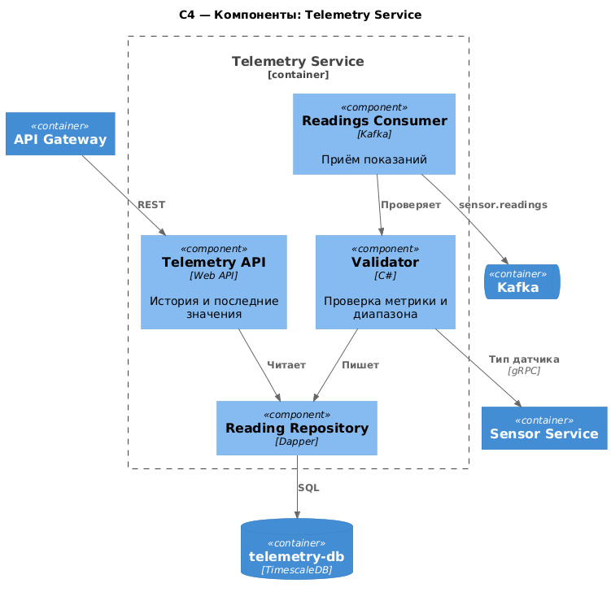
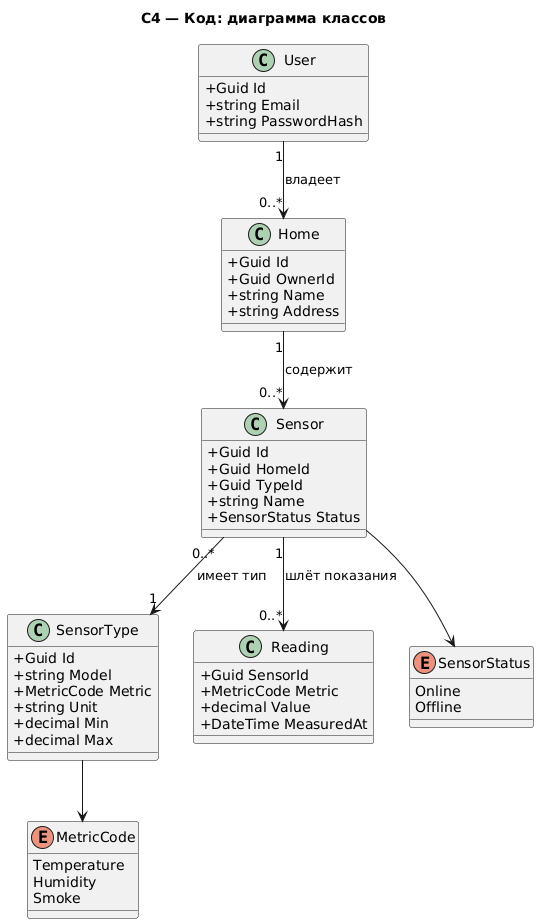
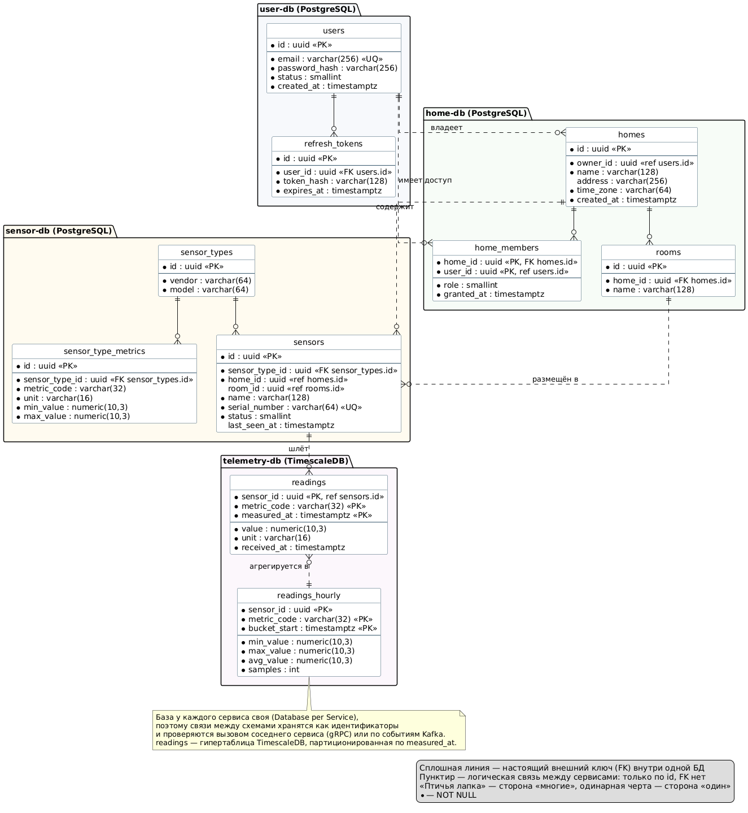

# Project_template

Это шаблон для решения проектной работы. Структура этого файла повторяет структуру заданий. Заполняйте его по мере работы над решением.

# Задание 1. Анализ и планирование

<aside>

Чтобы составить документ с описанием текущей архитектуры приложения, можно часть информации взять из описания компании и условия задания. Это нормально.

</aside

### 1. Описание функциональности монолитного приложения

**Управление отоплением:**

- Пользователи могут удалённо включать/выключать отопление в своих домах

**Мониторинг температуры:**

- Пользователи могут удалённо просматривать текущую температуру в своих домах

### 2. Анализ архитектуры монолитного приложения

- Приложение представляет собой монолитное решение, которое объединяет в себе функциональность управления отоплением и мониторинга температуры. Все компоненты приложения тесно связаны между собой, что затрудняет масштабирование и внедрение новых функций.
- Язык программирования: Go
- База данных: PostgreSQL

### 3. Определение доменов и границы контекстов


### **4. Проблемы монолитного решения**

- Монолитная, все компоненты системы (обработка запросов, бизнес-логика, работа с данными) находятся в рамках одного приложения.
- Ограничена, так как монолит сложно масштабировать по частям.
- Развертывание требует остановки всего приложения.

Текущее решение не соответствует требованием бизнес требований по внедрению новых независимых частей системы.

### 5. Визуализация контекста системы — диаграмма С4

Диаграмма контекста в модели C4.

```markdown
docs/architecture/Monolith_C4.md
```

# Задание 2. Проектирование микросервисной архитектуры

### Контейнеры



### Компоненты





### Код


# Задание 3. Разработка ER-диаграммы



# Задание 4. Создание и документирование API

### 1. Тип API

REST/JSON наружу (OpenAPI 3.0), HTTP между сервисами.

### 2. Документация API

Как посмотреть:

User.API Swagger UI: http://localhost:5050/swagger после docker compose up
Temperature.API Swagger UI: http://localhost:8282/swagger после docker compose up Swagger UI: http://localhost:5050/swagger после docker compose up
Sensor.API Swagger UI: http://localhost:8080/swagger после docker compose up Swagger UI: http://localhost:5050/swagger после docker compose up

# Задание 5. Работа с docker и docker-compose

- docker-compose поднимает сразу несколько сервисов, в том числе и базу данных Postgres. Для этого в docker-compose.yml добавлены настройки для запуска Postgres с указанием скрипта инициализации ./apps/postgres/init.sql.

- Приложения упакованы в Docker и добавлены в docker-compose. 
- User.API порт по умолчанию должен быть 5050
- Sensor.API - 8080
- Temperature.API - 8282.

docker-compose.yml добавлены настройки для запуска Postgres с указанием скрипта инициализации ./apps/postgres/init.sql.


