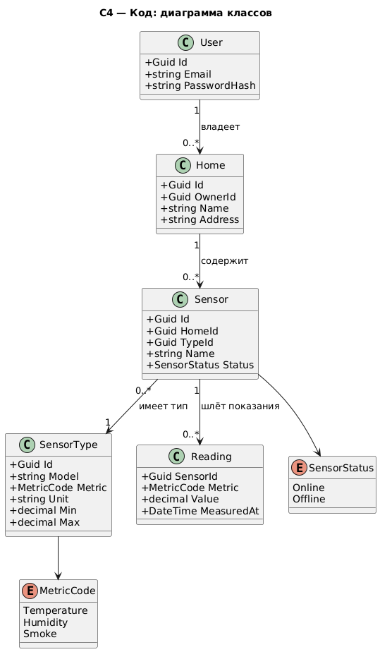
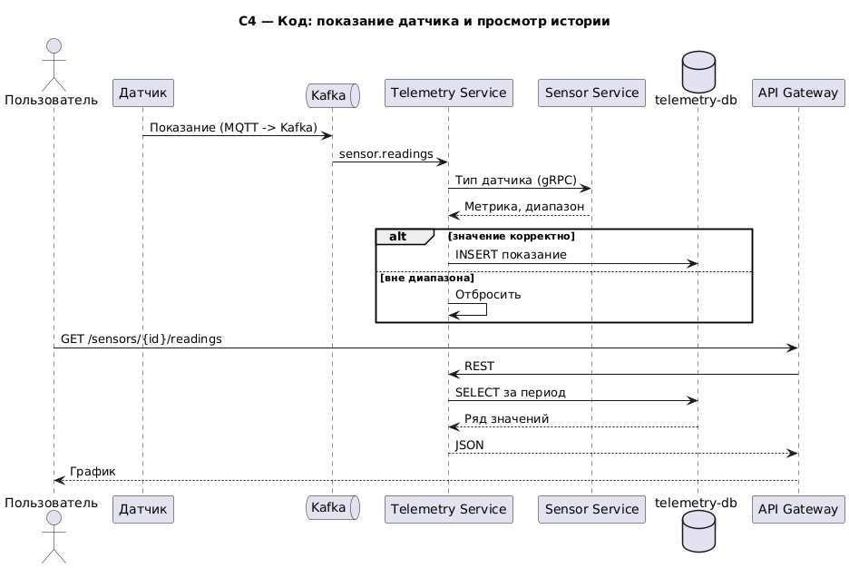

# C4 — «Умный дом» (минимальный вариант)

---

## Контейнеры (Containers)


<details>
<summary>PlantUML — <code>01-containers.puml</code></summary>

```plantuml
@startuml 01-containers
!include https://raw.githubusercontent.com/plantuml-stdlib/C4-PlantUML/master/C4_Container.puml
skinparam defaultFontName DejaVu Sans
LAYOUT_TOP_DOWN()
title C4 — Контейнеры

Person(user, "Пользователь")
System_Ext(sensor, "Датчик")

System_Boundary(sb, "Умный дом") {
  Container(app, "Клиентское приложение", "Web / Mobile")
  Container(gw, "API Gateway", "ASP.NET Core")

  Container(userSvc, "User Service", "ASP.NET Core", "Пользователи, вход, JWT")
  ContainerDb(userDb, "user-db", "PostgreSQL")

  Container(homeSvc, "Home Service", "ASP.NET Core", "Дома пользователя")
  ContainerDb(homeDb, "home-db", "PostgreSQL")

  Container(sensorSvc, "Sensor Service", "ASP.NET Core", "Датчики и их типы")
  ContainerDb(sensorDb, "sensor-db", "PostgreSQL")

  Container(telSvc, "Telemetry Service", "ASP.NET Core", "Показания датчиков")
  ContainerDb(telDb, "telemetry-db", "TimescaleDB")

  ContainerQueue(kafka, "Kafka", "Event Bus")
}

Rel(user, app, "Использует", "HTTPS")
Rel(app, gw, "REST", "HTTPS")
Rel(gw, userSvc, "REST")
Rel(gw, homeSvc, "REST")
Rel(gw, sensorSvc, "REST")
Rel(gw, telSvc, "REST")

Rel(homeSvc, userSvc, "Проверка пользователя", "gRPC")
Rel(sensorSvc, homeSvc, "Проверка дома", "gRPC")
Rel(telSvc, sensorSvc, "Тип датчика", "gRPC")

Rel(userSvc, userDb, "SQL")
Rel(homeSvc, homeDb, "SQL")
Rel(sensorSvc, sensorDb, "SQL")
Rel(telSvc, telDb, "SQL")

Rel(sensor, kafka, "Показания", "MQTT -> Kafka")
Rel(kafka, telSvc, "sensor.readings", "Kafka")
Rel(kafka, sensorSvc, "sensor.readings", "Kafka")

SHOW_LEGEND()
@enduml
```

</details>

---

## Компоненты: User Service


<details>
<summary>PlantUML — <code>02-component-user.puml</code></summary>

```plantuml
@startuml 02-component-user
!include https://raw.githubusercontent.com/plantuml-stdlib/C4-PlantUML/master/C4_Component.puml
skinparam defaultFontName DejaVu Sans
title C4 — Компоненты: User Service

Container(gw, "API Gateway")
ContainerDb(db, "user-db", "PostgreSQL")

Container_Boundary(c, "User Service") {
  Component(api, "User API", "Web API", "Регистрация, вход, профиль")
  Component(auth, "Auth Service", "C#", "Проверка пароля, выпуск JWT")
  Component(domain, "Модель User", "C#")
  Component(repo, "User Repository", "EF Core")
}

Rel(gw, api, "REST")
Rel(api, auth, "Вызывает")
Rel(auth, domain, "Использует")
Rel(auth, repo, "Читает/пишет")
Rel(api, repo, "Читает/пишет")
Rel(repo, db, "SQL")
@enduml
```

</details>

---

## Компоненты: Home Service


<details>
<summary>PlantUML — <code>03-component-home.puml</code></summary>

```plantuml
@startuml 03-component-home
!include https://raw.githubusercontent.com/plantuml-stdlib/C4-PlantUML/master/C4_Component.puml
skinparam defaultFontName DejaVu Sans
title C4 — Компоненты: Home Service

Container(gw, "API Gateway")
Container(userSvc, "User Service")
ContainerDb(db, "home-db", "PostgreSQL")

Container_Boundary(c, "Home Service") {
  Component(api, "Home API", "Web API", "CRUD домов")
  Component(svc, "Home Service", "C#", "Создание и изменение дома")
  Component(domain, "Модель Home", "C#", "Дом, комнаты")
  Component(repo, "Home Repository", "EF Core")
}

Rel(gw, api, "REST")
Rel(api, svc, "Вызывает")
Rel(svc, userSvc, "Проверка пользователя", "gRPC")
Rel(svc, domain, "Использует")
Rel(svc, repo, "Читает/пишет")
Rel(repo, db, "SQL")
@enduml
```

</details>

---

## Компоненты: Sensor Service


<details>
<summary>PlantUML — <code>04-component-sensor.puml</code></summary>

```plantuml
@startuml 04-component-sensor
!include https://raw.githubusercontent.com/plantuml-stdlib/C4-PlantUML/master/C4_Component.puml
skinparam defaultFontName DejaVu Sans
title C4 — Компоненты: Sensor Service

Container(gw, "API Gateway")
Container(homeSvc, "Home Service")
ContainerQueue(kafka, "Kafka")
ContainerDb(db, "sensor-db", "PostgreSQL")

Container_Boundary(c, "Sensor Service") {
  Component(api, "Sensor API", "Web API", "Регистрация датчика, список датчиков дома")
  Component(svc, "Sensor Service", "C#", "Привязка датчика к дому, статус online/offline")
  Component(domain, "Модель Sensor", "C#", "Датчик и его тип")
  Component(repo, "Sensor Repository", "EF Core")
  Component(consumer, "Readings Consumer", "Kafka", "Отмечает активность датчика")
}

Rel(gw, api, "REST")
Rel(api, svc, "Вызывает")
Rel(svc, homeSvc, "Проверка дома", "gRPC")
Rel(svc, domain, "Использует")
Rel(svc, repo, "Читает/пишет")
Rel(consumer, kafka, "sensor.readings")
Rel(consumer, repo, "Обновляет статус")
Rel(repo, db, "SQL")
@enduml
```

</details>

---

## Компоненты: Telemetry Service


<details>
<summary>PlantUML — <code>05-component-telemetry.puml</code></summary>

```plantuml
@startuml 05-component-telemetry
!include https://raw.githubusercontent.com/plantuml-stdlib/C4-PlantUML/master/C4_Component.puml
skinparam defaultFontName DejaVu Sans
title C4 — Компоненты: Telemetry Service

Container(gw, "API Gateway")
Container(sensorSvc, "Sensor Service")
ContainerQueue(kafka, "Kafka")
ContainerDb(db, "telemetry-db", "TimescaleDB")

Container_Boundary(c, "Telemetry Service") {
  Component(consumer, "Readings Consumer", "Kafka", "Приём показаний")
  Component(validator, "Validator", "C#", "Проверка метрики и диапазона")
  Component(api, "Telemetry API", "Web API", "История и последние значения")
  Component(repo, "Reading Repository", "Dapper")
}

Rel(consumer, kafka, "sensor.readings")
Rel(consumer, validator, "Проверяет")
Rel(validator, sensorSvc, "Тип датчика", "gRPC")
Rel(validator, repo, "Пишет")
Rel(gw, api, "REST")
Rel(api, repo, "Читает")
Rel(repo, db, "SQL")
@enduml
```

</details>

---

## Код: классы


<details>
<summary>PlantUML — <code>06-code-class.puml</code></summary>



</details>

---

## Код: последовательность


<details>
<summary>PlantUML — <code>07-code-seq.puml</code></summary>



</details>
